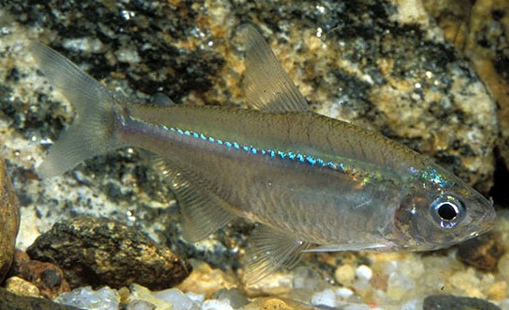
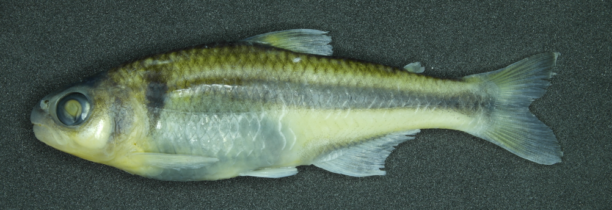
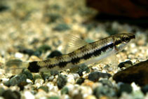
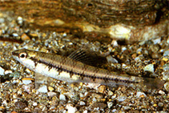
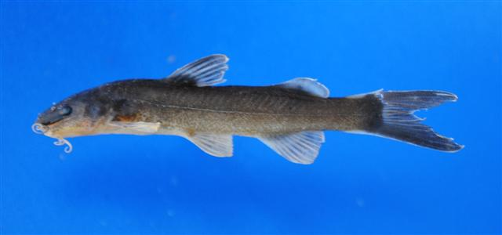
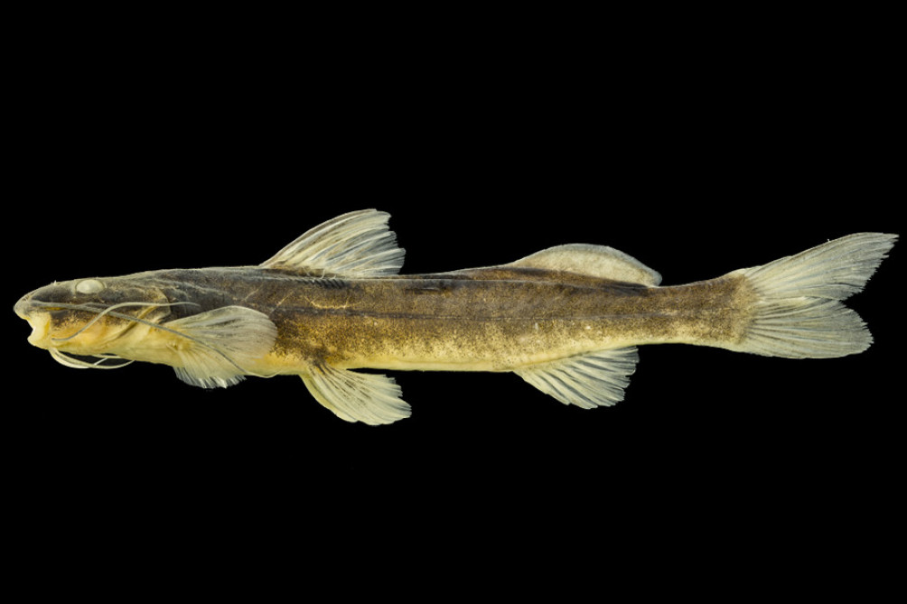
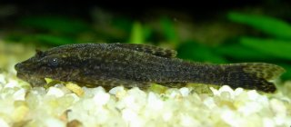
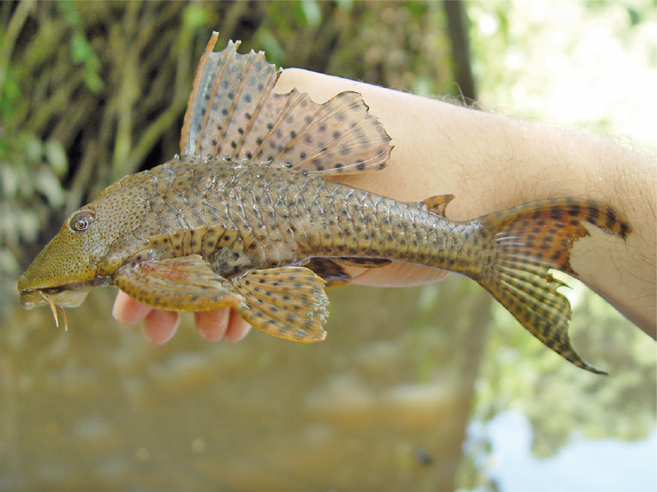

```{r}
library(gt)
library(dplyr)
library(tidyr)
library(readr)
```

## Matriz de Atributos Morfológicos

```{r}
tf <- data.frame(
  row.names = c("CI", "RD", "IVF", "RAC", "REP", "MO"),
  Bstr = c(1.67, 0.21, 0.57, 0.14, 0.70, 1.26),
  Bsp = c(1.71, 0.26, 0.53, 0.13, 0.68, 1.74),
  Cfasc = c(1.41, 0.21, 0.51, 0.14, 0.79, 3.03),
  Czeb = c(1.47, 0.22, 0.49, 0.11, 0.80, 1.98),
  Cih = c(0.97, 0.17, 0.59, 0.22, 0.91, 2.06),
  Imin = c(0.69, 0.12, 0.55, 0.26, 0.76, 2.24),
  Hsp = c(0.73, 0.16, 0.39, 0.19, 0.71, 3.14),
  Hgar = c(0.66, 0.19, 0.35, 0.30, 0.85, 3.14)
)

n_tracos = nrow(tf)
n_sp = ncol(tf)

v_dot_u = sum(tf$Bstr * tf$Bsp)
nv = tf$Bstr^2 |> sum() |>  sqrt()
nu = tf$Bsp^2 |> sum() |>  sqrt()

cos_sim = v_dot_u / (nv * nu)

```

Considere a situação em que temos `r n_sp` espécies de peixes descritas por `r n_tracos` *atributos funcionais* (@tbl-tracos). Atributos funcionais são características morfológicas, fisiológicas ou comportamentais mensuráveis que influenciam diretamente o desempenho ecológico das espécies, determinando como elas interagem com o ambiente e utilizam recursos, como habitat, alimento e abrigo. Espera-se, por exemplo, que espécies similares em seus atributos funcionais ocupem um espaço de nicho semelhante e respondam de forma parecida a pressões ambientais. Nosso objetivo será quantificar **o grau de similaridade** entre pares de espécies por meio do índice de *similaridade por cossenos*.

| Traço | Bstr      | Bsp       | Cfasc     | Czeb      | Cih       | Imin      | Hsp       | Hypsp      |
|-------|-----------|-----------|-----------|-----------|-----------|-----------|-----------|-----------|
| CI    | `r tf[1,1]` | `r tf[1,2]` | `r tf[1,3]` | `r tf[1,4]` | `r tf[1,5]` | `r tf[1,6]` | `r tf[1,7]` | `r tf[1,8]` |
| RD    | `r tf[2,1]` | `r tf[2,2]` | `r tf[2,3]` | `r tf[2,4]` | `r tf[2,5]` | `r tf[2,6]` | `r tf[2,7]` | `r tf[2,8]` |
| IVF   | `r tf[3,1]` | `r tf[3,2]` | `r tf[3,3]` | `r tf[3,4]` | `r tf[3,5]` | `r tf[3,6]` | `r tf[3,7]` | `r tf[3,8]` |
| RAC   | `r tf[4,1]` | `r tf[4,2]` | `r tf[4,3]` | `r tf[4,4]` | `r tf[4,5]` | `r tf[4,6]` | `r tf[4,7]` | `r tf[4,8]` |
| REP   | `r tf[5,1]` | `r tf[5,2]` | `r tf[5,3]` | `r tf[5,4]` | `r tf[5,5]` | `r tf[5,6]` | `r tf[5,7]` | `r tf[5,8]` |
| MO    | `r tf[6,1]` | `r tf[6,2]` | `r tf[6,3]` | `r tf[6,4]` | `r tf[6,5]` | `r tf[6,6]` | `r tf[6,7]` | `r tf[6,8]` |

: Atributos funcionais entre 8 espécies de peixes de riachos. **CI**: Índice de compressão; **RD**: Altura relativa; **IVF**: Índice de achatamento ventral; **RAC**: Área relativa da nadadeira caudal; **REP**: Posição relativa do olho; **MO**: orientação da boca. **Bstr**: *Bryconamericus stramineus*; **Bsp**: *Bryconamericus* sp.; **Cfasc**: *Characidium fasciatum*; **Czeb**: *Characidium zebra*; **Cih**: *Cetopsorhamdia iheringi*; **Imin**: *Imparfinis minutus*; **Hsp**: *Hisonotus* sp.; **Hypsp**: *Hypostomus sp*. {#tbl-tracos .striped}

::: {#fig-peixes layout-ncol=2 layout-nrow=4 fig-cap="Espécies da @tbl-tracos."}

{width=80%}

{width=80%}

{width=80%}

{width=80%}

{width=80%}

{width=80%}

{width=80%}

{width=80%}

:::

Cada espécie está representada em uma coluna, e as linhas correspondem às medidas morfológicas associadas aos atributos funcionais das espécies. Em notação matricial, podemos representar a @tbl-tracos como:

$$\mathbf{T} = 
\begin{bmatrix}
`r tf[1,1]` & `r tf[1,2]` & \dots & `r tf[1,8]`\\
`r tf[2,1]` & `r tf[2,2]` & \dots & `r tf[2,8]`\\
\vdots & \vdots & \ddots & \vdots\\
`r tf[6,1]` & `r tf[6,2]` & \dots & `r tf[6,8]`
\end{bmatrix}
$$

## Calculando Similaridade por cossenos

Cada espécie na @tbl-tracos pode ser vista como um *vetor* $\vec{v}$ ou $\vec{u}$ com `r n_tracos` entradas, uma para cada traço funcional. Assim, o cosseno do ângulo $\theta$ entre os vetores pode ser calculado por:

$$\cos(\theta) = \frac{\vec{v} \cdot \vec{u}}{\|\vec{v}\| \|\vec{u}\|}
$$ {#eq-cos-angulo}

Onde:

- $\vec{v} \cdot \vec{u}$ é o **produto escalar** entre os vetores $\vec{v}$ e $\vec{u}$.
- $\|\vec{v}\|$ e $\|\vec{u}\|$ são as **normas** (comprimentos) dos vetores.
- $\theta$ é o ângulo entre os vetores no espaço multidimensional de `r n_tracos` dimensões.

O valor do $\cos(\theta)$ funciona como um *índice de similaridade* cuja interpretação ecológica é direta:

- **$\cos(\theta) \approx 1$** (ângulo próximo a 0°), indica espécies com alta similaridade funcional, compartilhando estratégias ecológicas semelhantes;
- **$\cos(\theta) \approx 0$** (ângulo próximo a 90°) revela espécies ecologicamente distintas, com atributos funcionais divergentes.

---

## Exemplo Prático: Similaridade entre *Bstr* e *Bsp*

1. **Vetores das espécies**:

$$
\vec{v}_{\text{Bstr}} = \begin{bmatrix}
`r tf[1,1]` \\ `r tf[2,1]` \\ `r tf[3,1]` \\ `r tf[4,1]` \\ `r tf[5,1]` \\ `r tf[6,1]`
\end{bmatrix}, \quad
\vec{u}_{\text{Bsp}} = \begin{bmatrix}
`r tf[1,2]` \\ `r tf[2,2]` \\ `r tf[3,2]` \\ `r tf[4,2]` \\ `r tf[5,2]` \\ `r tf[6,2]`
\end{bmatrix}
$$

2. **Produto Escalar**:

$$\vec{v} \cdot \vec{u} = (`r tf[1,1]` \times `r tf[1,2]`) + (`r tf[2,1]` \times `r tf[2,2]`) + \dots + (`r tf[6,1]` \times `r tf[6,2]`) = `r round(v_dot_u, 3)`$$

3. **Normas dos Vetores**:
$$\|\vec{v}\| = \sqrt{`r tf[1,1]`^2 + `r tf[2,1]`^2 + \dots + `r tf[6,1]`^2} \approx `r round(nv, 4)`$$
$$\|\vec{u}\| = \sqrt{`r tf[1,2]`^2 + `r tf[2,2]`^2 + \dots + `r tf[6,2]`^2} \approx `r round(nu, 4)`$$

4. **Cosseno do Ângulo**:
$$\cos(\theta) = \frac{`r round(v_dot_u, 3)`}{`r round(nv, 4)` \times `r round(nu, 4)`} \approx `r round(cos_sim,3)`$$

---

## Similaridade por Cossenos a partir de operações matriciais

```{r}
TR = as.matrix(tf)
E = t(TR) %*% TR

normas <- sqrt(diag(E))  # Vetor com normas de cada espécie
D = diag(1/normas)
C = D %*% E %*% D
colnames(C) = rownames(C) = colnames(T)

```

Os passos do item anterior podem ser generalizados para todos os pares de espécies utilizando uma sequência de operações matriciais.

1. **Obtenção da Matriz de Produtos Escalares ($\mathbf{E}$)**:
$$\mathbf{E} = \mathbf{T}^\top \mathbf{T}$$

$$\mathbf{T^\top} = 
\begin{bmatrix}
`r tf[1,1]` & `r tf[2,1]` & \dots & `r tf[6,1]`\\
`r tf[1,2]` & `r tf[2,2]` & \dots & `r tf[6,2]`\\
\vdots & \vdots & \ddots & \vdots\\
`r tf[1,8]` & `r tf[2,8]` & \dots & `r tf[6,8]`
\end{bmatrix}, \quad
\mathbf{E} = 
\begin{bmatrix}
e_{11} & e_{12} & \dots & e_{18}\\
e_{21} & e_{22} & \dots & e_{28}\\
\vdots & \vdots & \ddots & \vdots\\
e_{81} & e_{82} & \dots & e_{88}
\end{bmatrix}
$$

<!-- ```{r}
#| label: tbl-tr
#| tbl-cap: Transposta da matriz T.
TR |> 
   t() |> 
   as.data.frame() |> 
   rownames_to_column("Espécie") |> 
   gt() |> 
  fmt_number(
    columns = where(is.numeric),
    decimals = 4                
  ) |> 
  tab_options(
    table.font.size = px(13),
    table.font.names = "Arial"
  )
``` -->

<!-- ```{r}
#| label: tbl-E
#| tbl-cap: Matriz $\mathbf{E}$ de produtos escalares.
#| eval: false
E |> 
   as.data.frame() |> 
   rownames_to_column("Espécie") |> 
   gt() |> 
  fmt_number(
    columns = where(is.numeric),
    decimals = 4                
  ) |> 
  tab_options(
    table.font.size = px(13),
    table.font.names = "Arial"
  )
``` -->

2. **Obtenção da Matriz $\mathbf{D}$**:

As normas dos vetores de espécies da matriz $\mathbf{T}$ podem ser obtidas a partir dos elementos da *diagonal* da matriz $\mathbf{E}$, em que:

$$\text{norma}_i = \sqrt{e_{ii}}$$

Sabendo disso, obtenha a Matriz $\mathbf{D}$:

$$\mathbf{D} = 
\begin{bmatrix}
\frac{1}{\sqrt{e_{11}}} & 0 & \dots & 0\\
0 & \frac{1}{\sqrt{e_{22}}} & \dots & 0\\
\vdots & \vdots & \ddots & \vdots\\
0 & 0 & \dots & \frac{1}{\sqrt{e_{88}}}
\end{bmatrix}
$$

<!-- ```{r}
#| label: tbl-D
#| tbl-cap: Matriz diagonal $\mathbf{D}$.
#| eval: false
D |> 
   as.data.frame() |> 
   setNames(colnames(tf)) |> 
   mutate(Espécie = colnames(tf), .before = 1)  |> 
   gt() |> 
  fmt_number(
    columns = where(is.numeric),
    decimals = 4                
  ) |> 
  sub_values(
    columns = where(is.numeric),
    fn = function(x) x == 0,  # Identifica os valores 0
    replacement = "0"         # Formata como inteiro (sem decimais)
  ) |> 
  tab_options(
    table.font.size = px(13),
    table.font.names = "Arial"
  )
``` -->

3. **Matriz Final de similaridade por cossenos ($\mathbf{C}$)**:

$$\mathbf{C} = \mathbf{D} \mathbf{E} \mathbf{D}
$$ {#eq-similaridade_cossenos}

<!-- ```{r}
#| label: tbl-C
#| tbl-cap: Matriz $\mathbf{C}$ de Similaridade por cossenos entre os pares de espécies.
#| eval: false
C |> 
  as.data.frame() |> 
  setNames(colnames(tf)) |> 
  mutate(Espécie = colnames(tf), .before = 1) |> 
  gt() |> 
  fmt_number(
    columns = where(is.numeric),
    decimals = 4
  ) |> 
  data_color(
    columns = where(is.numeric),
    fn = scales::col_bin(
      # palette = c("red", "orange", "yellow", "lightgreen", "green", "blue", 'black'),
      palette = c("salmon3", "orangered3",  "rosybrown4", "orchid4", "skyblue2", "dodgerblue3", 'royalblue4'),
      domain = c(0.7, 1),
      bins = c(0.7, 0.75, 0.8, 0.85, 0.9, 0.95, 0.9999, 1.0001) 
    )
  ) |> 
  tab_options(
    table.font.size = px(13),
    table.font.names = "Arial"
  )
``` -->

---

## Roteiro: Matriz de Similaridade no Google Planilhas

1. Acesse [sheets.google.com](https://sheets.google.com).
2. Insira os dados da tabela $\mathbf{T}$ (@tbl-tracos). *Se necessário, modifique o separador decimal de ponto (`.`) para vírgula (`,`).*
3. Calcule $\mathbf{T}^\top$.
   + Dica - utilize a fórmula:  

      ```excel
      =TRANSPOR()
      ```

4. Calcule a matriz $\mathbf{E}$.
   + Dica - utilize a fórmula: 

      ```excel
      =MATRIZ.MULT()
      ```

5. Calcule as normas das colunas da matriz $\mathbf{E}$ e monte a matriz diagonal $\mathbf{D}$.
   + Dica: A matriz diagonal $\mathbf{D}$ terá as mesmas dimensões de $\mathbf{E}$, mas será preenchida com zeros exceto na diagonal principal. Nela, os valores serão $\frac{1}{\sqrt{e_{ii}}}$, onde $e_{ii}$ são os elementos da diagonal principal de $\mathbf{E}$.
6. Calcule a matriz $\mathbf{C}$ conforme a @eq-similaridade_cossenos.
   + Dica - utilize a fórmula:   

      ```excel
      =MATRIZ.MULT()
      ```

7. **Verificação**: calcule o cosseno de $\theta$ entre algumas espécies utilizando a @eq-cos-angulo e verifique se os resultados coincidem com os observados na matriz de similaridade $\mathbf{C}$.

8. **Verificação**: Considerando as imagens apresentadas na @fig-peixes, avalie criticamente se a matriz de similaridade representa de maneira fidedigna a semelhança morfométrica entre as espécies.

